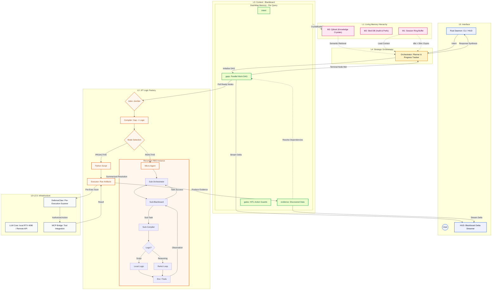
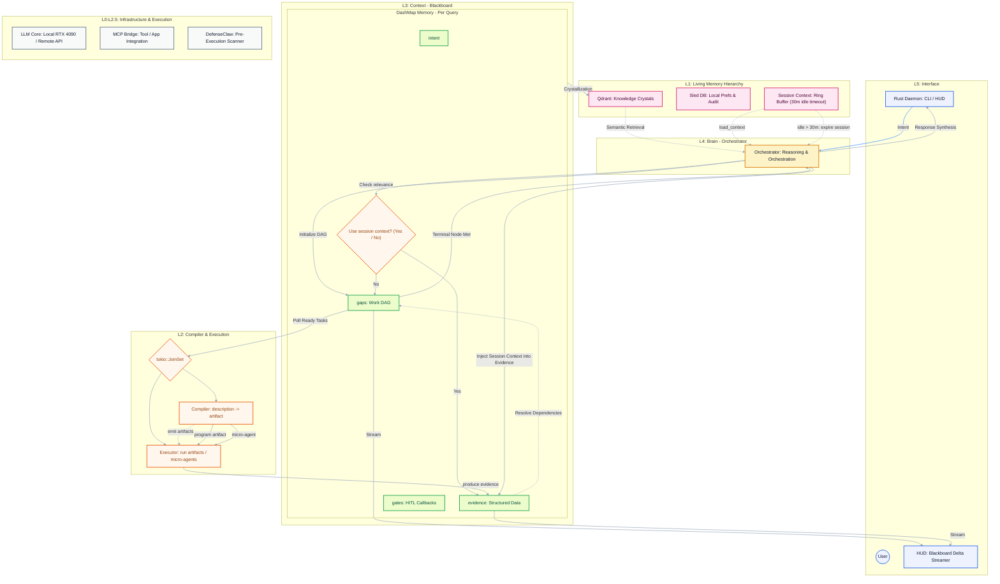

# Moss AI Operating System (AIOS)

Moss is a bio-inspired, high-performance AI Operating System built from first principles in Rust.
It transforms personal computing into a proactive, collaborative intelligence partner by moving logic closer to the hardware and treating sessions as living, "fresh-start" cycles.

## 🧬 Core Philosophy

- **The Fresh Start**: Every session clears the Blackboard (L3) to ensure reasoning is never cluttered by irrelevant history.
- **Logits-based Snapshotting**: Saves mathematical "thought states" into a Thin Active Cache (L1), allowing for sub-10ms resume latency via load_context syscalls.
- **Knowledge Crystallization**: Post-mission, the Meta-Agent compresses outcomes into Durable Artifacts stored in a Vector DB (L2).
- **Bio-Inspired Performance**: Achieves a 2.1x increase in execution speed by bypassing the von Neumann bottleneck through unified high-density inference on RTX 4090 Tensor Cores.
- **Session-aware Evidence Injection**: The Orchestrator can inject relevant session context into the Blackboard's evidence stream to preserve continuity during a session. Sessions persist while active and are subject to an idle timeout (see Session lifecycle below).

- **Relevance Gate (Yes/No)**: Before injection, the Orchestrator can optionally run a quick relevance check (yes/no). If the session context is not relevant to the new query, the gate returns `No` and the Blackboard remains unaffected.

## 🌀 The Recursive Blackboard System (RBS): Philosophy and Architecture

### 1. Philosophy: Logic Generation as the Universal Scaler
- RBS operates on the verdict that coding is the ultimate solution to the agentic scaling problem.
- Traditional systems rely on static "toolboxes" that suffer from selection errors and context bloat as they grow.
- RBS functions as a Just-In-Time (JIT) Logic Factory, generating the exact deterministic script or reasoning agent required to resolve an atomic gap.

- Deterministic Workhorses: Proactive tasks are compiled into Python scripts, providing high-efficiency, low-latency, and predictable execution.
- Recursive Reasoners: Complex tasks trigger a Micro-Agent, which is an encapsulated RBS instance (Orchestrator + Blackboard + Compiler). This provides Failure Containment; if a local search fails, it doesn't invalidate the global state.
- Parallelism via DAG: The Orchestrator treats the plan as a Directed Acyclic Graph (DAG), allowing independent gaps to be executed concurrently via Tokio JoinSet.

### 2. Architectural Layers
- L4: Orchestrator (The Strategic Mind) The Orchestrator decomposes high-level user intent into a Work DAG of atomic gaps. It monitors the Evidence on the Blackboard to determine which nodes are ready for execution and performs final response synthesis.
- L3: Blackboard (The DAG Scratchpad) A shared, high-performance memory space (utilizing DashMaps) that stores:
  - Gaps: The parallel dependency graph of tasks.
  - Evidence: Discovered structured data and partial solutions.
  - Gates: Human-in-the-loop (HITL) checkpoints for high-risk actions.
- L2: Compiler & Execution (The Logic Factory) The Compiler translates a gap description into an executable artifact.
  - Proactive Mode: Generates a self-contained script for known data operations.
  - Reactive Mode: Spawns a recursive Micro-Agent for environmental discovery (e.g., browsing).
- L1: Living Memory Hierarchy
  - M1 (Session Context): A ring buffer for immediate, short-term interaction history.
  - M2 (Sled DB): Local preferences and an audit trail for security compliance.
  - M3 (Knowledge Crystals): A vector database (Qdrant) storing crystallized historical plans and evidence for semantic retrieval.

### 3. Integrated System Flow (Mermaid)



### Session lifecycle

- **Duration & expiry**: Sessions are kept live to preserve context up to a 30-minute idle timeout. If a session is idle for more than 30 minutes it is cleared from the Blackboard (L3) and subsequent interactions start a fresh session.

### Gap Lifecycle

- **One-directional progression**: Blocked → Ready → Assigned → Closed.
- **Blocked**: The gap is waiting on one or more dependencies (other gaps). If a gap has no dependencies, it is auto-unblocked and becomes `Ready` immediately.
- **Ready**: Eligible to be polled by the scheduler / JoinSet for assignment to the `Compiler` (which produces a program) and the `Executor` (which runs it).
- **Assigned**: The Orchestrator has determined the gap's spec and the `Compiler` has emitted a program artifact; the `Executor` is responsible for running the program, posting progress, and producing Evidence.
- **Closed**: Terminal state; the gap is resolved (successful or terminally failed).

Notes:
- A gap enters `Blocked` when it depends on one or more other gaps. Dependency tracking is managed by the orchestrator; when dependencies are cleared the scheduler should auto-transition the gap to `Ready`.
- Retries, cancellations, or failure handling are implementation details handled by the `Executor` and orchestrator; the core lifecycle intentionally remains simple and linear.

### Blackboard Data Structure (Rust)

Below are minimal Rust types for `Gap`, `Evidence` and the `Blackboard` updated for the Compiler/Executor model. The snippet omits imports and visibility modifiers for brevity.

```rust
enum GapState {
    Blocked,
    Ready,
    Assigned,
    Closed,
}

struct Gap {
    gap_id: String,
    state: GapState,
    // Description: single free-form, instruction-like spec that fully describes the atomic task.
    // The `Compiler` consumes this `description` text to generate a program artifact.
    description: String,
    // Explicit dependency list (DAG edges)
    dependencies: Vec<String>,
    // Optional constraints the Compiler should respect (e.g., sandbox, runtime limits)
    constraints: Option<Value>,
    // Expected output descriptor (e.g., file path, json schema)
    expected_output: Option<String>,
}

struct Evidence {
    gap_id: String,
    content: Value,
    done: bool,
}

struct Blackboard {
    intent: Option<String>,
    // evidences: map from gap id -> Evidence
    evidences: DashMap<String, Evidence>,
    gaps: DashMap<String, Gap>,
    gates: DashMap<String, Value>,
}
```

Implementation notes:
- Use `DashMap` for concurrent reads/writes from the Orchestrator, Compiler and Executor.
- The Orchestrator (orchestrator) is responsible for breaking a user intent into an explicit DAG of `Gap` specs; each `Gap.spec` should be precise enough for the `Compiler` to generate a program without ambiguity.
- Persist only durable artifacts (post-crystallization) to L2 (Qdrant); keep the Blackboard as L3 per-session ephemeral context.

Evidence definition: small JSON-serializable records produced by the `Executor` or Orchestrator and stored in the Blackboard's `evidences` map keyed by `gap_id`.

- The `Compiler` emits one of two artifact types from a `Gap.spec`:
    1. **Program artifact (proactive):** a concrete, runnable program or script that the `Executor` runs to complete the gap deterministically when possible.
    2. **Micro-agent (reactive):** a small iterative agent loop designed for non-deterministic, dynamic environments (for example: web browsing, interactive APIs, or long-running negotiations). Micro-agents sense, act, and adapt until success criteria are met or a timeout/terminal failure occurs.

- The `Executor` can run program artifacts in a sandbox or host micro-agents in a constrained runtime, posts `Evidence`, and may spawn new gaps as needed.

## 🧪 Baseline Test Scenarios

### 🕹️ Level 1: Basic Reflex
- Scenario: Move a high-res photo from Downloads to primary memory.
- Metric: Machine Pulse executes semantic search and move syscall without manual paths.

### 🧠 Level 2: Contextual Intuition
- Scenario: Summarize PDF receipts from email and update local expense spreadsheet.
- Metric: Network Pulse retrieves data via MCP; Machine Pulse performs local writes.

### 🌐 Level 3: Advanced Chore
- Scenario: Book the cheapest Tokyo flight for Friday on a previously used airline.
- Metric: Semantic retrieval of preferences + dynamic web orchestration.

### 🛡️ Level 4: Sovereign Intelligence
- Scenario: Fix auth bugs in a Rust project, verify via web, and notify Slack.
- Metric: Error interpretation + autonomous recovery + DefenseClaw safety scanning.

## ⚙️ High-Performance Tech Stack (2026)

- Reasoning Core: DeepSeek-V3.2-Exp / GLM-4.5-Air (Optimized for tool/web use).
- Governance: DefenseClaw (Pre-execution runtime scanning).
- Protocol: MCP (Model Context Protocol).
- Hardware: NVIDIA RTX 4090 (vLLM core, unified safety + reasoning pipeline).

## 🗺️ Development Roadmap: The Genesis Loop

| Phase | Milestone | Focus |
| --- | --- | --- |
| Day 1 | The Seed | Core Rust Daemon, L5 CLI, and structured JSON Blackboard loop. |
| Day 2 | The Parallel Workforce | Thread-bound Expert Agents (Pulses) & Round Robin (RR) Scheduler. |
| Day 3 | The Sensory Bridge | MCP Integration for standardized AIOS Syscalls (Browsers/Files). |
| Day 4 | The Living Memory | Logits-based Context Manager for instant reasoning restoration. |
| Day 5 | The Final Synthesis | Knowledge Crystallization pipeline & Born Observable HUD telemetry. |

## 🧩 Architecture Diagram (Mermaid)



### Session lifecycle

- **Duration & expiry**: Sessions are kept live to preserve context up to a 30-minute idle timeout. If a session is idle for more than 30 minutes it is cleared from the Blackboard (L3) and subsequent interactions start a fresh session.

## 🚧 Gap Lifecycle

- **One-directional progression**: Blocked → Ready → Assigned → Closed.
- **Blocked**: The gap is waiting on one or more dependencies (other gaps). If a gap has no dependencies, it is auto-unblocked and becomes `Ready` immediately.
- **Ready**: Eligible to be polled by the scheduler / JoinSet for assignment to the `Compiler` (which produces a program) and the `Executor` (which runs it).
- **Assigned**: The Orchestrator/Orchestrator has determined the gap's spec and the `Compiler` has emitted a program artifact; the `Executor` is responsible for running the program, posting progress, and producing Evidence.
- **Closed**: Terminal state; the gap is resolved (successful or terminally failed).


Notes:
- A gap enters `Blocked` when it depends on one or more other gaps. Dependency tracking is managed by the orchestrator; when dependencies are cleared the scheduler should auto-transition the gap to `Ready`.
- Retries, cancellations, or failure handling are implementation details handled by the `Executor` and orchestrator; the core lifecycle intentionally remains simple and linear.

## 🧠 Blackboard Data Structure (Rust)

Below are minimal Rust types for `Gap`, `Evidence` and the `Blackboard` updated for the Compiler/Executor model. The snippet omits imports and visibility modifiers for brevity.

```rust
enum GapState {
    Blocked,
    Ready,
    Assigned,
    Closed,
}

struct Gap {
    gap_id: String,
    state: GapState,
    // Description: single free-form, instruction-like spec that fully describes the atomic task.
    // The `Compiler` consumes this `description` text to generate a program artifact.
    description: String,
    // Explicit dependency list (DAG edges)
    dependencies: Vec<String>,
    // Optional constraints the Compiler should respect (e.g., sandbox, runtime limits)
    constraints: Option<Value>,
    // Expected output descriptor (e.g., file path, json schema)
    expected_output: Option<String>,
}

struct Evidence {
    gap_id: String,
    content: Value,
    done: bool,
}

struct Blackboard {
    intent: Option<String>,
    // evidences: map from gap id -> Evidence
    evidences: DashMap<String, Evidence>,
    gaps: DashMap<String, Gap>,
    gates: DashMap<String, Value>,
}
```

Implementation notes:
- Use `DashMap` for concurrent reads/writes from the Orchestrator, Compiler and Executor.
- The Orchestrator (orchestrator) is responsible for breaking a user intent into an explicit DAG of `Gap` specs; each `Gap.spec` should be precise enough for the `Compiler` to generate a program without ambiguity.
- Persist only durable artifacts (post-crystallization) to L2 (Qdrant); keep the Blackboard as L3 per-session ephemeral context.

Evidence definition: small JSON-serializable records produced by the `Executor` or Orchestrator and stored in the Blackboard's `evidences` map keyed by `gap_id`.

- The `Compiler` emits one of two artifact types from a `Gap.spec`:
    1. **Program artifact (proactive):** a concrete, runnable program or script that the `Executor` runs to complete the gap deterministically when possible.
    2. **Micro-agent (reactive):** a small iterative agent loop designed for non-deterministic, dynamic environments (for example: web browsing, interactive APIs, or long-running negotiations). Micro-agents sense, act, and adapt until success criteria are met or a timeout/terminal failure occurs.

- The `Executor` can run program artifacts in a sandbox or host micro-agents in a constrained runtime, posts `Evidence`, and may spawn new gaps as needed.

## 🧪 Baseline Test Scenarios

### 🕹️ Level 1: Basic Reflex
- Scenario: Move a high-res photo from Downloads to primary memory.
- Metric: Machine Pulse executes semantic search and move syscall without manual paths.

### 🧠 Level 2: Contextual Intuition
- Scenario: Summarize PDF receipts from email and update local expense spreadsheet.
- Metric: Network Pulse retrieves data via MCP; Machine Pulse performs local writes.

### 🌐 Level 3: Advanced Chore
- Scenario: Book the cheapest Tokyo flight for Friday on a previously used airline.
- Metric: Semantic retrieval of preferences + dynamic web orchestration.

### 🛡️ Level 4: Sovereign Intelligence
- Scenario: Fix auth bugs in a Rust project, verify via web, and notify Slack.
- Metric: Error interpretation + autonomous recovery + DefenseClaw safety scanning.

## ⚙️ High-Performance Tech Stack (2026)

- Reasoning Core: DeepSeek-V3.2-Exp / GLM-4.5-Air (Optimized for tool/web use).
- Governance: DefenseClaw (Pre-execution runtime scanning).
- Protocol: MCP (Model Context Protocol).
- Hardware: NVIDIA RTX 4090 (vLLM core, unified safety + reasoning pipeline).
