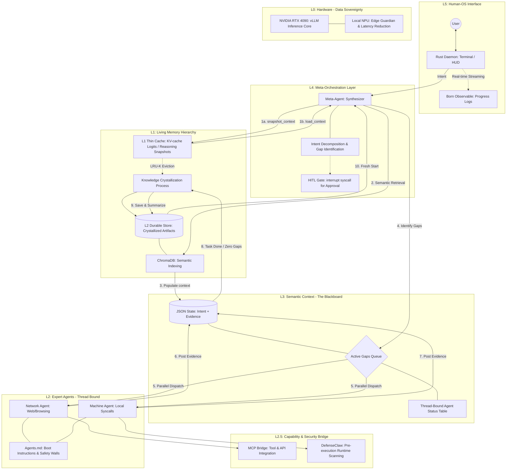

# Moss AI Operating System (AIOS)

Moss is a bio-inspired, high-performance AI Operating System built from first principles in Rust.
It transforms personal computing into a proactive, collaborative intelligence partner by moving logic closer to the hardware and treating sessions as living, "fresh-start" cycles.

## 🧬 Core Philosophy

- **The Fresh Start**: Every session clears the Blackboard (L3) to ensure reasoning is never cluttered by irrelevant history.
- **Logits-based Snapshotting**: Saves mathematical "thought states" into a Thin Active Cache (L1), allowing for sub-10ms resume latency via load_context syscalls.
- **Knowledge Crystallization**: Post-mission, the Meta-Agent compresses outcomes into Durable Artifacts stored in a Vector DB (L2).
- **Bio-Inspired Performance**: Achieves a 2.1x increase in execution speed by bypassing the von Neumann bottleneck through Heterogeneous Computing (RTX 4090/NPU).

## 🗺️ Development Roadmap: The Genesis Loop

| Phase | Milestone | Focus |
| --- | --- | --- |
| Day 1 | The Seed | Core Rust Daemon, L5 CLI, and structured JSON Blackboard loop. |
| Day 2 | The Parallel Workforce | Thread-bound Expert Agents (Pulses) & Round Robin (RR) Scheduler. |
| Day 3 | The Sensory Bridge | MCP Integration for standardized AIOS Syscalls (Browsers/Files). |
| Day 4 | The Living Memory | Logits-based Context Manager for instant reasoning restoration. |
| Day 5 | The Final Synthesis | Knowledge Crystallization pipeline & Born Observable HUD telemetry. |

## 🧩 Architecture Diagram (Mermaid)

## 🧪 Baseline Test Scenarios

### 🕹️ Level 1: Basic Reflex
- Scenario: Move a high-res photo from Downloads to primary memory.
- Metric: Machine Pulse executes semantic search and move syscall without manual paths.

### 🧠 Level 2: Contextual Intuition
- Scenario: Summarize PDF receipts from email and update local expense spreadsheet.
- Metric: Network Pulse retrieves data via MCP; Machine Pulse performs local writes.

### 🌐 Level 3: Advanced Chore
- Scenario: Book the cheapest Tokyo flight for Friday on a previously used airline.
- Metric: Semantic retrieval of preferences + dynamic web orchestration.

### 🛡️ Level 4: Sovereign Intelligence
- Scenario: Fix auth bugs in a Rust project, verify via web, and notify Slack.
- Metric: Error interpretation + autonomous recovery + DefenseClaw safety scanning.

## ⚙️ High-Performance Tech Stack (2026)

- Reasoning Core: DeepSeek-V3.2-Exp / GLM-4.5-Air (Optimized for tool/web use).
- Governance: DefenseClaw (Pre-execution runtime scanning).
- Protocol: MCP (Model Context Protocol).
- Hardware: NVIDIA RTX 4090 (vLLM core) + Local NPU (Edge Guardian).
